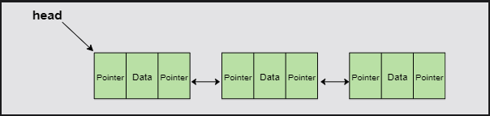

# Doubly Linked Lists (DLL)
>
> For any function which does not operate at the head node, we must traverse the whole list in a loop.
> While the search operation in a normal list works in the same way, access is much faster as lists allow indexing.
> Furthermore, since a linked list can only be traversed in one direction, we needlessly have to keep track of previous elements.
> This is where the doubly linked list comes to the rescue!

## Structure of the Doubly Linked List(DLL)
>
> In DLLs each node contains pointers for both the previous and the next node. This makes the DLLs bi-directional.
> we simply need to add a new member to the already constructed Node class:

```python
class Node:
    def __init__(self, value):
        self.data = value  # Stores data
        self.previous_element = None  # Stores pointer to previous element
        self.next_element = None  # Stores pointer to next element
```

> Explanation: data and next_element remain unchanged. The previous_element pointer has been introduced to store information about the preceding node.


