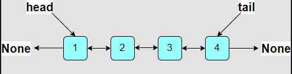

# Singly Linked Lists vs. Doubly Linked Lists

## Which is Better

DLLs have a few advantages over SLLs, but these perks do not come without a cost:

- Doubly linked lists can be traversed in both directions, which makes them more compatible with complex algorithms.
- Nodes in doubly linked lists require extra memory to store the previous_element pointer.
- Deletion is more efficient in doubly linked lists as we do not need to keep track of the previous node. We already have a backwards pointer for it.

### Tail Pointer in a Linked List

To add the tail functionality, all we have to do is add another member to our `LinkedList` class:

```python
class Node:
    def __init__(self, data):
        self.data = data
        self.next_element = None
        self.previous_element = None

class LinkedList:
    def __init__(self):
        self.head_node = None
        self.tail_node = None  # Keep track of the last
```

In a singly linked list, insert_at_tail now works in `O(1)`. We can simply set the new node as the `next_element` of the previous end node and update the tail_node.



The tail updates every time a new node is added at the end or a node is deleted from the end. The good news is that these operations are just as fast as `delete_at_head` and `insert_at_head`.
