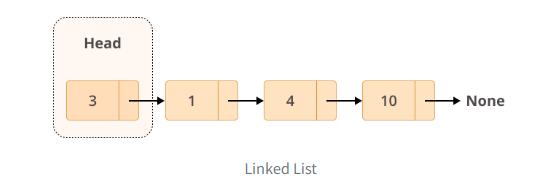
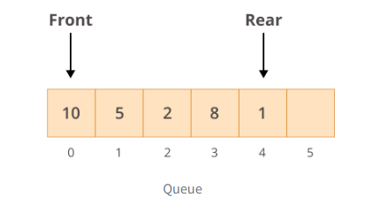
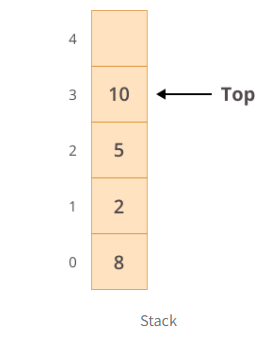

### Types of Insertion

> The three types of insertion strategies used in singly linked-lists are:
>
> - Insertion at the head
> - Insertion at the tail
> - Insertion at the kth index
>
---
`Insertion at head` This type of insertion means that we want to insert a new element as the first element of the list.

***[Overview of Linked Lists](https://realpython.com/linked-lists-python/)***

> Lists use a contiguous memory block to store references to their data, linked lists store references as part of their own elements.
>
> A linked list is a collection of nodes. The first node is called the head, and it’s used as the starting point for any iteration through the list. The last node must have its next reference pointing to None to determine the end of the list.

>
> They can be used to implement (spoiler alert!) queues or stacks as well as graphs.

### Queues or Stacks
>
> Queues and stacks differ only in the way elements are retrieved. 
> For a queue, you use a First-In/First-Out (FIFO) approach. That means that the first element inserted in the list is the first one to be retrieved:
> 
>
> When you append new elements to the queue, they’ll go to the rear end. When you retrieve elements, they’ll be taken from the front of the queue.
>
> For a stack, you use a Last-In/Fist-Out (LIFO) approach, meaning that the last element inserted in the list is the first to be retrieved:
> 
>
> Linked lists have a performance advantage over normal lists when implementing a queue (FIFO), in which elements are continuously inserted and removed at the beginning of the list. But they perform similarly to a list when implementing a stack (LIFO), in which elements are inserted and removed at the end of the list.
