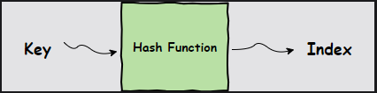
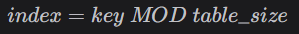
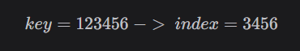
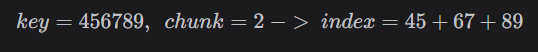
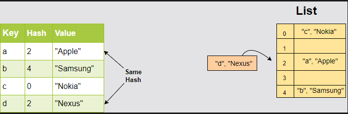
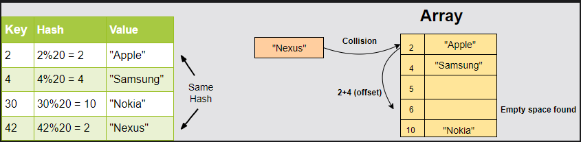
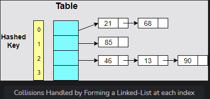

# Hashing

Hashing is a process used to store an object according to a unique key. This means that hashing always creates a key-value pair. A collection of such pairs forms a dictionary where every object or value can be looked up according to its key. Hence, the search operation can be performed in O(1).

## Hash Tables

If your algorithm prioritizes search operations, then a hash table is the best data structure for you. In Python, hash tables are generally implemented using lists as they provide access to elements in constant time. In Python, we have several in-built types such as set and dict which can provide us the hash table functionality.
The performance of a hash table depends on three fundamental factors:

- Hash function
- Size of the hash table
- Collision handling method

## The Hash Function

### Restricting the Key Size

A **key** is used to map a value on the list and the efficiency of a hash table depends on how a key is computed. At first glance, you may observe that we can directly use the indices as keys because each index is unique.

The only problem is that the key would eventually exceed the size of the list and, at every insertion, the list would need to be resized. Syntactically, we can easily increase list size in Python, but as we learned before, the process still takes O(n) time at the back end.

In order to limit the range of the keys to the boundaries of the list, we need a function that converts a large key into a smaller key. This is the job of the hash function.


A hash function simply takes an item’s key and returns the corresponding index in the list for that item.

## Arithmetic Modular

In this approach, we take the modular of the key with the list size:


Hence, the `index` will always stay between `0` and `tableSize - 1`.

```python
def hash_modular(key, size):
    return key % size


lst = [None] * 10  # List of size 10
key = 35
index = hash_modular(key, len(lst))  # Fit the key into the list size
print("The index for key " + str(key) + " is " + str(index))
```

## Truncation

Select a part of the key as the index rather than the whole key. Once again, we can use a mod function for this operation, although it does not need to be based on the list size:


```python
def hash_trunc(key):
    return key % 1000  # Will always give us a key of up to 3 digits


key = 123456
index = hash_trunc(key)  # Fit the key into the list size
print("The index for key " + str(key) + " is " + str(index))
```

## Folding

Divide the key into small chunks and apply a different arithmetic strategy at each chunk. For example, you add all the smaller chunks together:


```python
def hash_fold(key, chunk_size):  # Define the size of each divided portion
    str_key = str(key)  # Convert integer into string for slicing
    print("Key: " + str_key)
    hash_val = 0
    print("Chunks:")
    for i in range(0, len(str_key), chunk_size):
        if(i + chunk_size < len(str_key)):
            # Slice the appropriate chunk from the string
            print(str_key[i:i+chunk_size])
            hash_val += int(str_key[i:i+chunk_size])  # convert into integer
        else:
            print(str_key[i:len(str_key)])
            hash_val += int(str_key[i:len(str_key)])
    return hash_val


key = 3456789
chunk_size = 2
print("Hash Key: " + str(hash_fold(key, chunk_size)))
```

## Collisions in Hash Tables

When you map large keys into a small range of numbers from 0-N, where N is the size of the list, there is a huge possibility that two different keys may return the same index. This phenomenon is called collision.


## Strategies to Handle Collisions

There are several ways to work around collisions in the list. The three most common strategies are:

- Linear Probing
- Chaining
- Resizing the list

### 1. Linear Probing

This strategy suggests that if our hash function returns an index that is already filled, move to the next index. This increment can be based on a fixed offset value to an already computed index. If that index is also filled, traverse further until a free spot is found.



### 2. Chaining

In the chaining strategy, each slot of our hash table holds a pointer to another data structure such as a linked list or a tree. Every entry at that index will be inserted into the linked list for that index.

As you can see, chaining allows us to hash multiple key-value pairs at the same index in constant time (insert at head for linked lists).

This strategy greatly increases performance, but it is costly in terms of space.


### 3. Resizing the List

Another way to reduce collisions is to resize the list. We can set a threshold and once it is crossed, we can create a new table which is double the size of the original. All we have to do then is to copy the elements from the previous table.

Resizing the list significantly reduces collisions, but the function itself is costly. Therefore, we need to be careful about the threshold we set. A typical convention is to set the threshold at **0.6**, which means that when 60% of the table is filled, the resize operation needs to take place.

Another factor to keep in mind is the content of the hash table. The stored records might be concentrated in one region, leaving the rest of the list empty. However, this behavior will not be picked up by the resize function and you will end up resizing inappropriately.
